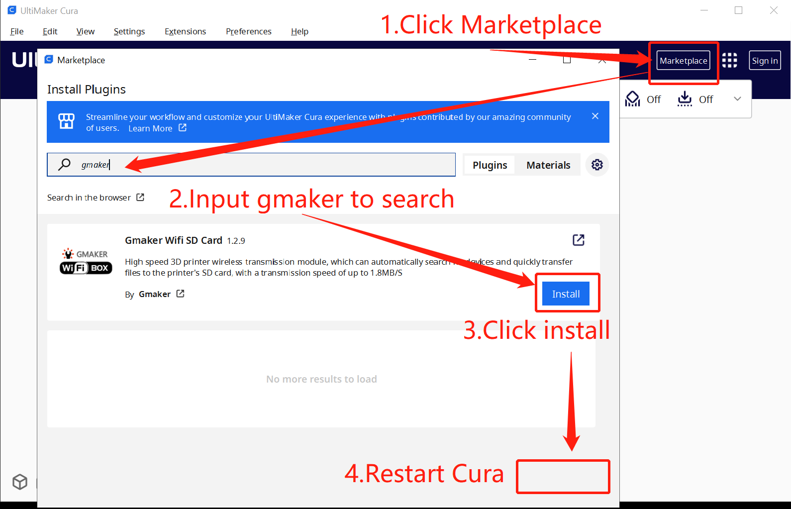
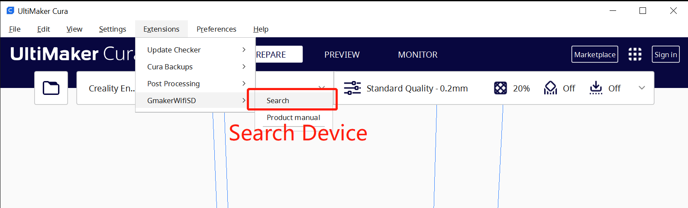
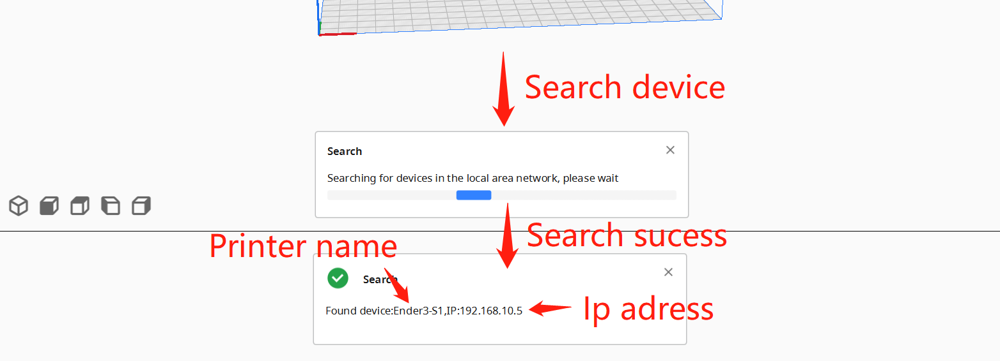
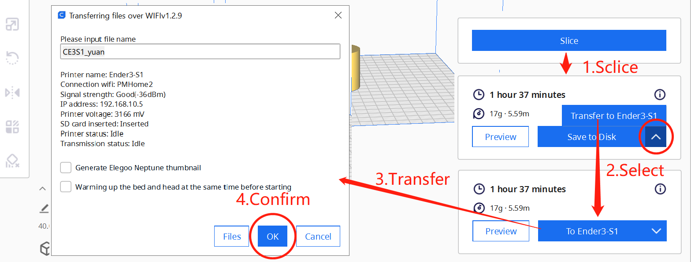
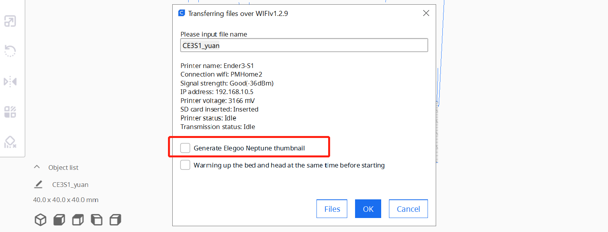

# Cura slicing plugin installation

## 1.Plugin installation
Download Cura from [Official website](https://ultimaker.com/software/ultimaker-cura/) Recommend downloading the latest version,then install it.Follow the steps below to install the plugin.

## 2.  Search Device
After installation, you need to restart the Cura software and search for wifi boxes in the local area network through menu Extension>GmakerWifiSD>Search. Please note that only wifi boxes in the same local area network can be searched

After searching for a device, the following prompt will appear

## 3.  Slicing and transmission
Open the model to be printed, set various slicing parameters, and click the slicing button in the bottom right corner. After slicing is completed, several storage options will appear in the bottom right corner of the button, as shown in the following figure, to select and transfer to the printer

## 5.  About Elegoo Neptune 3 Series

Elegoo Neptune 3 series thumbnails use thumbnails in a special format. We have integrated this function into the transmission software. If necessary, you can check the option of the transmission user interface

