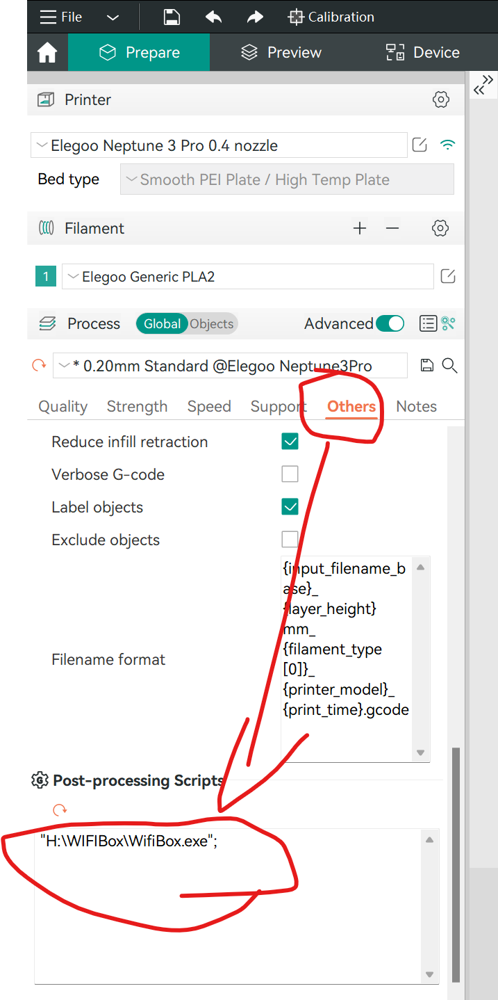
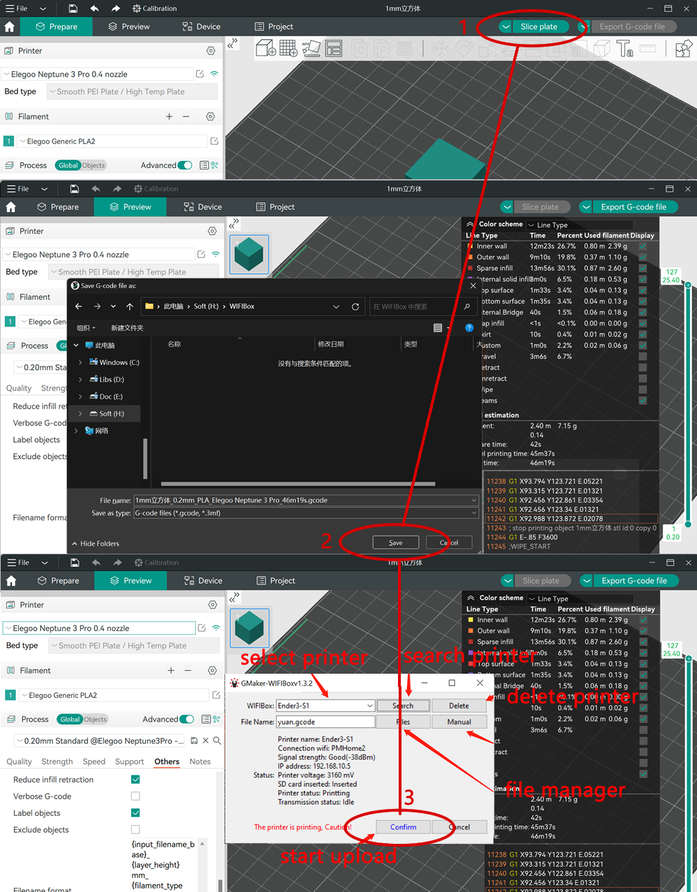

# Orca plugin installation on Windows 8/10/11 OS

## 1.Download transmission software
Download transmission software [Download](https://github.com/GMaker-git/WIFISD/releases/download/v1.3.10/WifiBox.exe),Save it to your computer.

## 2.Set Plugin 

Copy the path of the WIFIBox. exe file and fill in the location as shown in the picture

If the settings are correct, the following window will pop up after orca slicing and saving, so that the sliced file can be transferred to the printer here

If this is the first time using the search button to locate the device, enter the file name stored on the SD card. Confirm the transfer to complete the slice transfer to the printer

 
 
