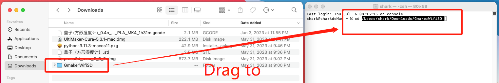

# Prusa plugin installation on Windows 8/10/11 OS

## 1.Python3 installation
Download and install Python 3.11 or later from the [Official website](https://www.python.org/downloads/),Pay attention to checking the following options during installation.

## 2.Plugin installation
Download and install Prusa software from the [Official website](https://www.prusa3d.com/page/prusaslicer_424/)

Download the plugin package [plugin package V1.3.1](https://gitee.com/g-maker/wifisd/releases/download/v1.3.1/GmakerWifiSD1.3.1.zip) Extract the files to a suitable folder (do not place them in folders with special characters)

## 3.Set Plugin 

Open wifibox.exe in the plugin package, which will have an additional PrusaPath.txt file in the same folder. Open it and copy all the contents.Then paste the content into the input box as shown in the following figure.

If the settings are correct, the following window will pop up after Prusa slicing and saving, so that the sliced file can be transferred to the printer here

If this is the first time using the search button to locate the device, enter the file name stored on the SD card. Confirm the transfer to complete the slice transfer to the printer

 
 

# Prusa plugin installation on Mac OS

1. Download the plugin ,Download package and release it to any directory (preferably the path should not contain special characters)

2. Install Python 3.11, [Download](https://www.python.org/downloads/release/python-3114/ ) from official website, install Python according to the default options. After the download is completed, start the installation as shown in the following figure, keep clicking continue and the last step is complete.

3. Change file permissions

Use the terminal command line tool to enter the path of CD+plugin package, then enter chmod u+x *. py and press Enter to open permissions to all programs, as shown in the following figure

input cd[space] and drag download folder into terminal window

input chmod u+x *. py and enter

drag Fileupload.py into terminal window and copy the path

open prusa and set output options with "python3 " is start.  

**Please note that this user interface will only pop up after the Save Slice File dialog box is completed**

To use or add a new device for the first time, click the search button first, then select the device to transfer from the drop-down box, enter the file name, and click Confirm to transfer