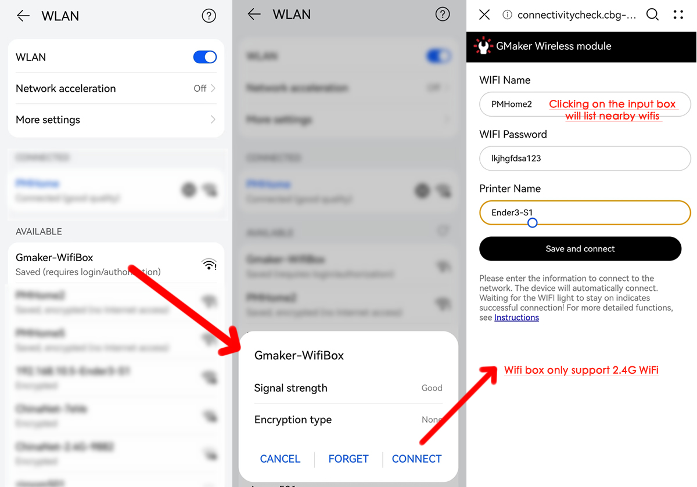

[中文版](https://gitee.com/g-maker/wifisd/blob/master/README.md)

# Gmaker Wifi transmission module for FDM 3D printers

Solve the problem of many FDM 3D printers on the market without wireless transmission modules,Abbreviated as WiFi box

## Features
---

1. Install the Cura plugin or Prusa plugin to automatically search for devices (LAN), which can be directly transferred to the printer after slicing

2. Initialization installation can be done by scanning hotspots on a mobile phone or computer to connect to a wireless local area network. There is no need to remember the IP address

3. The transmission speed can reach up to 1.8MB/S (when the WIFI signal is strong)

4. Plug and play, no need to disassemble the printer or update the printer firmware, just plug in a cable to use

5. A simple WEB management user interface for file management and firmware upgrade

6. Fast and accurate. After the file transfer is completed, an MD5 file fingerprint comparison will be performed. If the transfer file is found to be incomplete or any byte is incorrect, the file will be automatically deleted and a retransmission is required. This can avoid strange problems during the printing process after file transfer errors

7. After transferring the files, the WIFI box will automatically notify the printer to refresh the file list, without the need to restart the printer

## Structure
---

**1.  Power indicator** : Display whether the power supply is normal. The status is as follows
- Steady on: The power supply is normal
- Blinking: The power supply is insufficient

**2.  Wifi indicator** :  Displays the networking status. The status is as follows
- Steady on: The network is set and connected
- Blinking slowly (once every second): The network is being connected
- Quick blink (5 times per second): The network is not configured, and you need to use a mobile phone or computer to set up the network

**3. Transfer indicator**: Displays the file transfer status, The status is as follows
- Off: No file is transmitting
- Blinking slowly (once every second): The file is transmitting

**4.  Card indicator**:Displays the SD card slot on the fuselage is inserted. The status is as follows
- Off: No SD card is detected
- Steady on: An SD card is detected

**5.  Print indicator**: Displays whether the printer is printing, The status is as follows
- Off: The printer is not printing
- Blinking slowly (once every 1 second): The file may be being printed or the printer may be reading the file list. In this case, a warning dialog box is displayed when the file is being transferred

**6.  Card slot**
- Supports TF cards or microSD cards of less than 32 GB

**7.  Reset Button**
- Clear the set network information, used in case of password error or network connection change, hold down until all indicators are no longer blinking, then release the button to clear.

**8.  Usb Power supply**
- The current of the SD card slot interface of most printers is sufficient for module use, and this interface is only reserved. After the TF plug, the power indicator blinks obviously, indicating that the power supply of the module is insufficient. Plug in the standard Type-c charging cable to power the wifi box, power requirements (DC 5V,0.5A)

## Working principle
---

The WIFI box is programmed to control whether the SD card is used by the printer or for wireless transmission. The slicing software asks if the box is in print before initiating the transfer. If in print, the user is reminded whether to force the transfer. Therefore, the file cannot be transferred during the printing process, otherwise the printer will not detect the card and cause printing failure.

## Adaptive 3D printer
---

The WIFI box was designed for all printers, and any printer with a card slot can theoretically be used. Currently, it has been clearly verified that the available machines are as follows:

- ELEGOO  Neptune 3 Pro/Max/Plus

- Anycubic Kobra 2/Max/go

- CREALITY 3D ENDER-3 S1/Pro/Plus

- CREALITY 3D ENDER-3 V2/Nero/Max

- Two Trees Sp5

- KingRoon KP3S Pro/S1

- Prusa Mk3s/Mk3s+

## Installation steps
---

Please follow the steps shown in the following figure for installation

## Configure network
---

1. Confirm that the device is in a configured state
The first installation of the product will automatically enter the configuration state, and the "WIFI" indicator light will flash quickly (every 0.2 seconds). If it is not in this state, please press and hold the "reset button" until all indicator lights are no longer flashing, and then release it. This operation will clear all settings and enter the configuration state
2. Connect hotspots and configure networking information
Using a mobile phone (Android or Apple) or laptop with WiFi (Win10/Win11) to scan nearby WiFi, you will find a hotspot called "GMaker-WifiBox". Connecting to this hotspot for a few seconds will automatically enter the configuration user interface, as shown in the following figure:

Select the nearby available WIFI (automatically listed and sorted by signal strength), enter the password, and then enter the name of the printer to be inserted. The configuration is complete, and the "WIFI" indicator light will slowly flash, indicating that you are trying to connect to the network. If you have been unable to connect, you may have entered an incorrect password. You can go back to the first step and start again. If you successfully connect to the network, the "Networking" indicator light will remain on, not flashing
 
 

---

## Cura slicing plugin installation
Go to [Cura slicing plugin installation](Cura.md)

---

## Prusa slicing plugin installation

Go to [Prusa slicing plugin installation](Prusa.md)

---

## Manually adding an IP address

Used when the network to which the printer is connected and the laptop network are on the same large network, but not on the same subnet, and the laptop cannot search for devices

Go to [Manually adding an IP address](IP.md)

---

 
 

## Frequently asked question(FAQ)
---

**1. Question: How can I see which files are in the SD card**

Answer: There is a "Files" button on the transmission interface, which can be clicked to perform file management and firmware upgrade

**2. Question: Why is my file transfer speed only 500KB/S**

Answer: The transmission speed is affected by several factors. If the computer is far away from the WiFi box and separated by a wall, it will affect the transmission speed. In addition, the sector size of the SD card also greatly affects the card writing speed. It is recommended that if the printer supports it, the SD card sector can be formatted as 32K. Normally, laptops and WiFi boxes can have a room with a router that is not far away, and the speed can reach 2MB/S

**3. Question: Why can't I search for my device**

Answer: There are two possible scenarios. The first is that the WIFI signal is too weak and the WiFi box cannot receive the search information. The second is that the computer and WiFi box are on different networks and are isolated by network devices. It is necessary to ensure that the computer and WiFi are on the same LAN

**4. Question: Why is the printer screen not displaying the latest file after transferring the file**

Answer: When the WIFI box is working normally, after transferring the file, it will automatically notify the printer that the file has been updated and automatically refresh the file list. This function can be achieved without brushing the printer firmware. If there are two possible situations of not refreshing, the first is that the plug inserted into the printer card slot is not tightly inserted, You can try unplugging and plugging it in again (pushing the plug in again to make the plug naturally pop up, and then plugging it in again). The second scenario is that some printer file lists are not automatically refreshed but manually refreshed, similar to Anycubic's Kobra series. You need to click refresh on the screen to refresh the files
